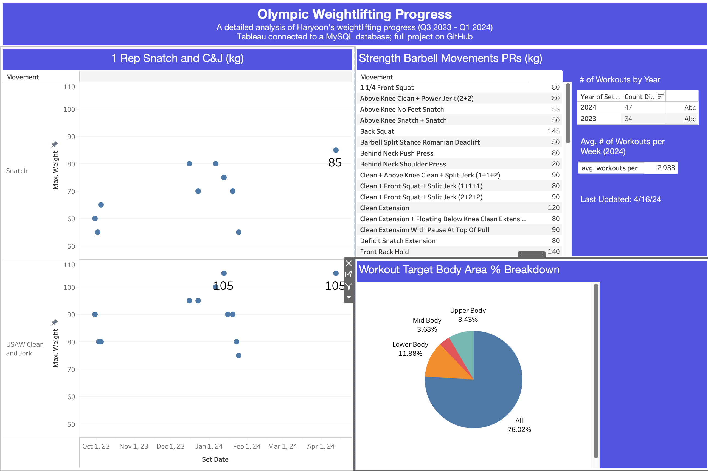

## Project Description

Olympic weightlifting combines my pursuit of strength with my passion for databases and data visualization; I created this project to monitor my Olympic weightlifting training progress while honing my SQL and Tableau skills.

For context, Olympic weightlifting is a competitive sport featuring two primary lifts: the snatch and the clean and jerk. The snatch involves lifting the barbell from the ground to overhead in one motion, while the clean and jerk consists of lifting it to the shoulders before jerking it overhead. Competitions are categorized by weight classes, with athletes receiving three attempts in each lift to achieve the highest total weight lifted. The lifter with the greatest combined weight in the snatch and clean and jerk triumphs.

  

### Tableau Data Visualization 

The project ends with a data visualization in Tableau -- a detailed analysis of my weightlifing progress. This dashboard is also viewable on [Tableau Public](https://public.tableau.com/app/profile/haryoon.jang/viz/OlympicWeightliftingVisualization/Dashboard1).

  

### Database Creation

I started this project by creating a database schema.
  

  

Based on the schema, I created three MySQL files, which enable users to track my training progress. The SQL files are as follows:

- **installation.sql**: This file establishes a database and five tables for tracking workout sets, movements, equipment used, movement types, and targeted body areas.
- **mock_data.sql**: It populates the database with my personal training data from late September 2023.
- **analysis.sql**: This file provides seven data views and analyses of my personal training data. For instance, one query or view enables users to view all my highest lifted weight sets categorized as “Strength/Power” movements using a barbell.

This project is presently in the Minimum Viable Product (MVP) phase and solely contains my data. In the future, I plan to develop a web application for others to track their own Olympic weightlifting progress, similar to a Strava for Olympic weightlifting. Potential future technologies may include Python, Flask, SQLAlchemy, HTML, CSS, JavaScript, and more.

## Example MySQL Query
Query to view clean and jerk history

  

## How to Install and Run the Project

1. Save the files locally or clone the repository.
2. Open a terminal or a SQL GUI, such as MySQL Workbench.
3. Execute the files in the following order:
    1. **installation.sql**
    2. **mock_data.sql**
    3. Open **analysis.sql** and select a query to run.
